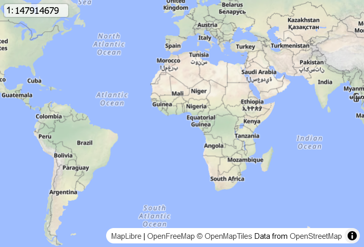

# Scale Ratio Control  

A custom control for MapLibre that enables users to:  
- Display the scale ratio (e.g., `1:15000`) based on the current zoom level.  
- Set the zoom level by inputting a scale ratio.  

The scale ratio is calculated using the **latitude at the center of the map view** and an **optional DPI value (default: 96)**.  

---

## Demo  

[Demo](https://tjmsy.github.io/maplibre-gl-scale-ratio/site/)



---

## Usage  


```javascript  
import { ScaleRatioControl } from 'https://cdn.jsdelivr.net/gh/tjmsy/maplibre-gl-scale-ratio@main/src/maplibre-gl-scale-ratio.js';
```  

```javascript  
const scaleRatioControl = new ScaleRatioControl();  
map.addControl(scaleRatioControl);  
```

```html
<link rel="stylesheet" href="https://cdn.jsdelivr.net/gh/tjmsy/maplibre-gl-scale-ratio@main/src/maplibre-gl-scale-ratio.css" />
```
